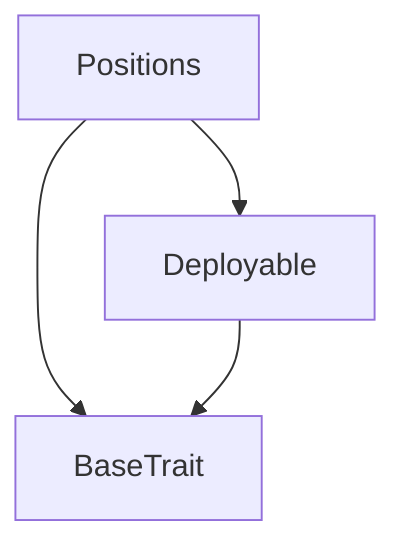

# TACT Compilation Report
Contract: Positions
BOC Size: 1361 bytes

# Types
Total Types: 16

## StateInit
TLB: `_ code:^cell data:^cell = StateInit`
Signature: `StateInit{code:^cell,data:^cell}`

## StdAddress
TLB: `_ workchain:int8 address:uint256 = StdAddress`
Signature: `StdAddress{workchain:int8,address:uint256}`

## VarAddress
TLB: `_ workchain:int32 address:^slice = VarAddress`
Signature: `VarAddress{workchain:int32,address:^slice}`

## Context
TLB: `_ bounced:bool sender:address value:int257 raw:^slice = Context`
Signature: `Context{bounced:bool,sender:address,value:int257,raw:^slice}`

## SendParameters
TLB: `_ bounce:bool to:address value:int257 mode:int257 body:Maybe ^cell code:Maybe ^cell data:Maybe ^cell = SendParameters`
Signature: `SendParameters{bounce:bool,to:address,value:int257,mode:int257,body:Maybe ^cell,code:Maybe ^cell,data:Maybe ^cell}`

## Deploy
TLB: `deploy#946a98b6 queryId:uint64 = Deploy`
Signature: `Deploy{queryId:uint64}`

## DeployOk
TLB: `deploy_ok#aff90f57 queryId:uint64 = DeployOk`
Signature: `DeployOk{queryId:uint64}`

## FactoryDeploy
TLB: `factory_deploy#6d0ff13b queryId:uint64 cashback:address = FactoryDeploy`
Signature: `FactoryDeploy{queryId:uint64,cashback:address}`

## OpenPosition
TLB: `open_position#8aa73d7f token:address entryPrice:coins amount:coins liquidationPrice:coins = OpenPosition`
Signature: `OpenPosition{token:address,entryPrice:coins,amount:coins,liquidationPrice:coins}`

## ClosePosition
TLB: `close_position#8ebdf4dd seqno:uint256 markPrice:coins value:coins = ClosePosition`
Signature: `ClosePosition{seqno:uint256,markPrice:coins,value:coins}`

## LiquidatePosition
TLB: `liquidate_position#3dab7731 seqno:uint256 markPrice:coins = LiquidatePosition`
Signature: `LiquidatePosition{seqno:uint256,markPrice:coins}`

## InternalOpenPosition
TLB: `internal_open_position#482f2873 sender:address token:address entryPrice:coins amount:coins liquidationPrice:coins = InternalOpenPosition`
Signature: `InternalOpenPosition{sender:address,token:address,entryPrice:coins,amount:coins,liquidationPrice:coins}`

## InternalClosePosition
TLB: `internal_close_position#522c75f6 sender:address seqno:uint256 markPrice:coins = InternalClosePosition`
Signature: `InternalClosePosition{sender:address,seqno:uint256,markPrice:coins}`

## InternalLiquidatePosition
TLB: `internal_liquidate_position#8b66d420 sender:address seqno:uint256 markPrice:coins = InternalLiquidatePosition`
Signature: `InternalLiquidatePosition{sender:address,seqno:uint256,markPrice:coins}`

## Position
TLB: `_ seqno:uint256 token:address entryPrice:coins amount:coins liquidationPrice:coins status:^string closePrice:coins = Position`
Signature: `Position{seqno:uint256,token:address,entryPrice:coins,amount:coins,liquidationPrice:coins,status:^string,closePrice:coins}`

## Positions$Data
TLB: `null`
Signature: `null`

# Get Methods
Total Get Methods: 2

## numPositions

## positions

# Error Codes
2: Stack underflow
3: Stack overflow
4: Integer overflow
5: Integer out of expected range
6: Invalid opcode
7: Type check error
8: Cell overflow
9: Cell underflow
10: Dictionary error
11: 'Unknown' error
12: Fatal error
13: Out of gas error
14: Virtualization error
32: Action list is invalid
33: Action list is too long
34: Action is invalid or not supported
35: Invalid source address in outbound message
36: Invalid destination address in outbound message
37: Not enough TON
38: Not enough extra-currencies
39: Outbound message does not fit into a cell after rewriting
40: Cannot process a message
41: Library reference is null
42: Library change action error
43: Exceeded maximum number of cells in the library or the maximum depth of the Merkle tree
50: Account state size exceeded limits
128: Null reference exception
129: Invalid serialization prefix
130: Invalid incoming message
131: Constraints error
132: Access denied
133: Contract stopped
134: Invalid argument
135: Code of a contract was not found
136: Invalid address
137: Masterchain support is not enabled for this contract
26863: This position has an incorrect liquidation price
28546: This position has a margin
28967: This method could be called only by the owner
32672: This position has already closed
40771: There is no such position
58322: This method could be called only by the parent

# Trait Inheritance Diagram

# Contract Dependency Diagram

